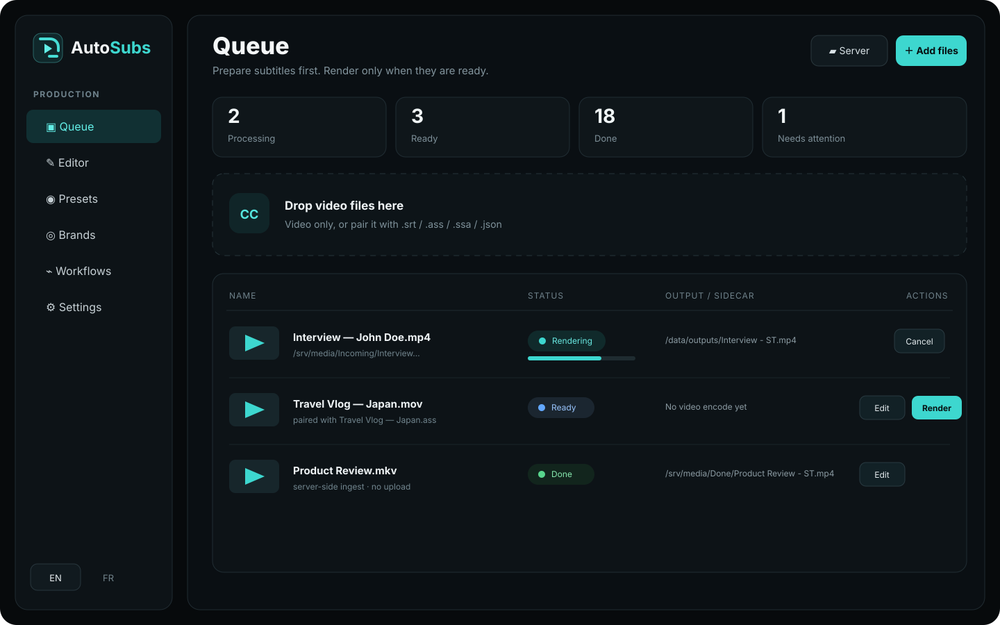
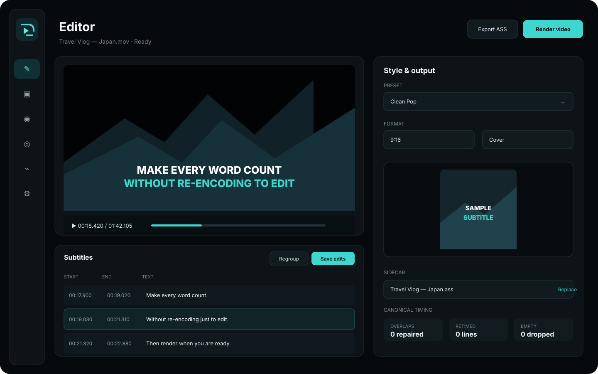
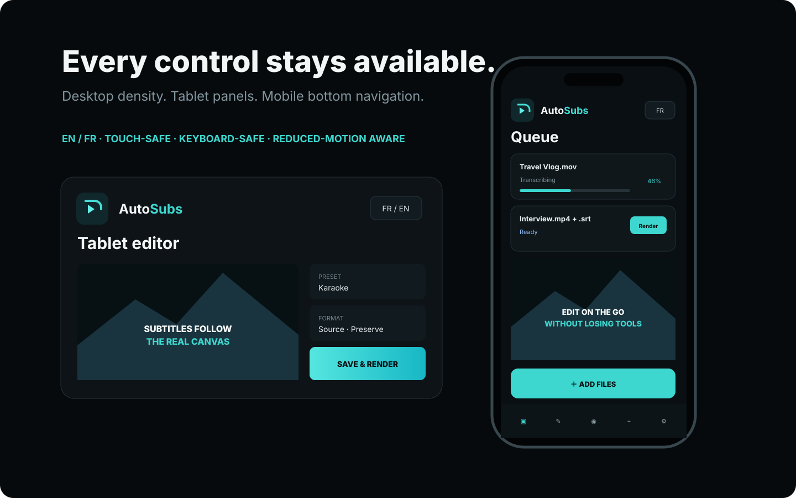

<p align="center">
  
</p>

<h1 align="center">AutoSubs</h1>

<p align="center">
  <b>Transcrire. Corriger. Styliser. Incruster — ou automatiser tout le dossier.</b><br>
  Un atelier self-hosted de production de sous-titres basé sur Rust, SvelteKit, FFmpeg/libass et le fournisseur de transcription de ton choix.
</p>

<p align="center">
  
  
  
  
  
  
</p>

<p align="center">🇬🇧 <a href="README.md">English README</a></p>

---

AutoSubs s'occupe de ce qui arrive **une fois la vidéo prête** : récupérer les timings mot-à-mot depuis Whisper/Speaches ou un fichier de sous-titres existant, corriger le texte, réparer les timings, appliquer un style, prévisualiser le bon format et laisser FFmpeg/libass incruster le résultat. Pour les traitements récurrents, un Workflow surveille un dossier et exécute le même pipeline automatiquement.

Le navigateur n'est pas le moteur métier. Rust possède la normalisation des timings, le découpage des lignes, la persistance, le rendu et l'état des workflows. L'UI appelle cette API : un traitement manuel et un traitement automatique passent donc par les mêmes règles.

## 📸 Aperçus

<p align="center"></p>
<p align="center"><i>File — uploads locaux reprenables et fichiers déjà montés alimentent la même file persistante.</i></p>

<p align="center"></p>
<p align="center"><i>Éditeur — preview vidéo navigable, liste des lignes, regroupement canonique, outils de timing et exports sans réencodage.</i></p>

<p align="center"></p>
<p align="center"><i>L'interface est pensée pour desktop, tablette et téléphone ; ce n'est pas simplement la version desktop compressée.</i></p>

## ✨ Fonctionnalités

- **Ingest vidéo sans mini-liste d'extensions** — `ffprobe` décide si un fichier stable contient réellement une piste vidéo.
- **Uploads reprenables** — protocole de type tus 1.0 avec `HEAD`/`PATCH`; après coupure ou reload, resélectionner le même fichier reprend à l'offset du serveur.
- **Picker serveur** — les vidéos déjà montées dans le conteneur ne sont pas recopiées inutilement.
- **Sidecars** — import `.ass`, `.ssa`, `.srt` ou JSON AutoSubs; ajout, remplacement ou suppression avant rendu.
- **Transcription** — endpoint externe compatible OpenAI + fournisseur local/fallback type Speaches.
- **Correction LLM optionnelle** — orthographe et ponctuation sans laisser le modèle modifier directement les timings.
- **Un seul moteur de timing** — Rust répare plages invalides, chevauchements, gaps et timings de mots. Le frontend ne possède pas une deuxième implémentation divergente.
- **Découpage Unicode/français** — comptage par graphèmes, opportunités Unicode et règles de non-coupure françaises.
- **Styles ASS/libass** — Pop, Karaoké, Fondu, Rebond, Slide-up, Floating ou aucun effet; polices, contour, ombre, position et couleur d'accent.
- **Formats réels** — Source, 9:16, 16:9, 1:1, 4:5 et custom. La géométrie source est préservée par défaut ; `contain`, `cover` et `stretch` sont explicites.
- **Brands / Marques** — logo, outro et preset par défaut selon le format.
- **Workflows** — dossiers watch/output/archive indépendants, résolution Brand/preset, événements natifs + réconciliation périodique pour les montages NFS.
- **Jamais d'archive après échec** — la source n'est déplacée qu'une fois vidéo + sidecars publiés avec succès.
- **Publication transactionnelle** — les anciennes sorties restent récupérables jusqu'au commit du nouveau jeu vidéo + SRT + ASS + JSON.
- **Jobs persistants** — SQLite garde file, réglages, workflows, assets et événements. Après crash/reboot, un job actif devient `interrupted`.
- **Annulation réelle** — l'attente d'un slot, les requêtes réseau et FFmpeg respectent le token d'annulation.
- **Progression FFmpeg dédiée** — lecture de `-progress`, pas parsing fragile de stderr.
- **Accélération détectée** — NVENC, QSV, VA-API, AMF ou libx264 selon le FFmpeg réellement installé. Le mode `auto` fait un seul fallback vers libx264 si le lancement matériel échoue.
- **Outro robuste** — normalisation canvas/FPS/audio puis concat dans le même encodage.
- **UI EN / FR** — switch instantané mémorisé dans le navigateur, totalement indépendant de la langue de transcription.

## 🚀 Installation

L'image préconstruite est `ghcr.io/godsquantum/autosubs:latest`.

```bash
mkdir autosubs && cd autosubs
curl -O https://raw.githubusercontent.com/GodsQuantum/AutoSubs/main/compose.example.yaml
curl -O https://raw.githubusercontent.com/GodsQuantum/AutoSubs/main/.env.example
cp .env.example .env
mkdir -p config data fonts media
# adapte MEDIA_PATH et les mounts, puis :
docker compose -f compose.example.yaml up -d
```

Ouvre `http://<ip-du-serveur>:3051`.

### Règle de stockage importante

`/config` contient `autosubs.db` et doit rester sur un stockage **local**. AutoSubs utilise SQLite WAL et refuse les filesystems réseau connus (NFS/CIFS/SSHFS) pour la base. Les vidéos, dossiers surveillés, sorties et archives peuvent en revanche vivre sur NFS ; monte-les séparément sous une racine autorisée.

```text
/config             SSD / filesystem local — SQLite uniquement
/data               données de travail — uploads/jobs/renders
/fonts              polices custom, lecture seule possible
/mnt/NAS/...        sources/sorties/archives volumineuses
```

## Migration d'un ancien déploiement

Les variables ont été renommées pour éviter les ambiguïtés :

```text
DATA_DIR         → AUTOSUBS_DATA_DIR=/data
FONTS_DIR        → AUTOSUBS_FONTS_DIR=/fonts
DIST_DIR         → supprimée : l'UI est intégrée directement à l'image
MAX_ENCODE_JOBS  → AUTOSUBS_MAX_RENDER_JOBS
SPEACHES_URL     → AUTOSUBS_LOCAL_TRANSCRIPTION_URL
```

`SPEACHES_URL` reste accepté comme alias de migration au **premier démarrage d'une DB vide**. Les variables provider servent uniquement à initialiser la DB ; ensuite les valeurs enregistrées depuis Settings deviennent la référence.

Un montage ancien du type `/home/.../autosubs/data:/app/data` doit être séparé :

```yaml
volumes:
  - /home/.../autosubs/config:/config
  - /home/.../autosubs/data:/data
  - /home/.../autosubs/fonts:/fonts:ro
  - /mnt/NAS:/mnt/NAS
```

## 🎬 Flux manuel

1. Ajoute une vidéo locale, une vidéo déjà montée, ou une paire vidéo + `.srt` / `.ass` / `.ssa` / `.json`.
2. AutoSubs inspecte le média puis importe ou génère les timings.
3. La correction LLM optionnelle ne touche qu'au texte.
4. Le moteur Rust normalise timings et regroupement.
5. Le job arrive à **Prêt**. Aucun encodage vidéo n'a encore été dépensé si le rendu immédiat n'a pas été demandé.
6. Corrige/recherche/remplace/regroupe/décale dans l'Éditeur.
7. Exporte SRT/ASS/JSON sans réencoder, ou lance **Rendre la vidéo**.
8. FFmpeg/libass écrit d'abord un staging `.partial`. `.partial` est strictement interne au média incomplet, jamais un format de sous-titres.
9. Vidéo et sidecars sont publiés ensemble ; l'archive éventuelle de la source arrive en dernier.

Cette étape **Prêt** évite de relancer un encode complet simplement pour corriger trois mots.

## Marques, presets et formats

Un **Preset** définit la typographie, l'animation, les couleurs, la position, les limites de segmentation, le mode d'adaptation, le format cible et éventuellement une outro spécifique.

Une **Marque** peut définir un logo, une outro et un preset par défaut pour chaque format. Un Workflow résout le style ainsi :

```text
preset explicite du workflow
        ↓
preset de la marque pour ce format
        ↓
résolution globale/par défaut
```

Le format choisi par le Job reste l'autorité. Sélectionner un preset ne transforme pas silencieusement un Job 16:9 en 9:16.

## 🔄 Dossiers surveillés

Les Workflows utilisent à la fois les événements filesystem locaux et une réconciliation périodique. C'est nécessaire sur NFS : un write distant ne provoque pas forcément l'événement inotify local attendu.

Avant de prendre un fichier en charge, AutoSubs vérifie stabilité taille/mtime, le passe à `ffprobe`, le déduplique dans SQLite puis cherche un sidecar :

```text
.ass / .ssa  →  .srt  →  .json  →  transcription
```

Si préparation ou rendu échoue, la source ne bouge pas.

## FFmpeg et accélération matérielle

L'image runtime contient FFmpeg/libass. AutoSubs sonde filtres, hwaccels et encodeurs H.264 au démarrage ; Settings montre ce que **ce conteneur précis** sait utiliser.

Pour Intel/AMD Linux, expose `/dev/dri` et les groupes video/render nécessaires. Pour NVIDIA, utilise NVIDIA Container Toolkit. L'exemple Compose n'accorde aucun GPU par défaut.

Le mode `auto` reste volontairement simple : si l'encodeur matériel choisi ne démarre pas, le rendu est retenté une fois en `libx264`.

## ⚙️ Configuration

| Variable | Défaut | Rôle |
|---|---|---|
| `AUTOSUBS_PORT` | `3000` | Port HTTP interne. |
| `AUTOSUBS_CONFIG_DIR` | `/config` | Dossier local SQLite/config. |
| `AUTOSUBS_DATA_DIR` | `/data` | Données uploads/jobs/renders. |
| `AUTOSUBS_FONTS_DIR` | `/fonts` | Polices custom. |
| `AUTOSUBS_ALLOWED_ROOTS` | `/data:/media` dans l'image | Racines visibles par le picker/workflows. Hors Docker, si la variable est absente, AutoSubs utilise son dossier data. |
| `AUTOSUBS_MAX_RENDER_JOBS` | `2` | Encodages lourds simultanés. |
| `AUTOSUBS_MAX_TRANSCRIPTION_JOBS` | `2` | Transcriptions simultanées. |
| `AUTOSUBS_MAX_QUEUED_JOBS` | `256` | Nombre maximal de jobs actifs admis simultanément dans la file. |
| `AUTOSUBS_WORKFLOW_SCAN_SECONDS` | `5` | Intervalle de réconciliation des workflows, y compris pour les écritures NFS ratées par les événements natifs. |
| `AUTOSUBS_FILE_STABILITY_MS` | `2000` | Fenêtre taille/mtime stable exigée avant d'accepter un fichier surveillé. |
| `AUTOSUBS_MAX_UPLOAD_BYTES` | `53687091200` | Taille max d'un upload reprenable (50 Gio). |

Variables d'initialisation d'une DB vide : `AUTOSUBS_TRANSCRIPTION_LANGUAGE`, `AUTOSUBS_TRANSCRIPTION_URL`, `AUTOSUBS_TRANSCRIPTION_MODEL`, `AUTOSUBS_TRANSCRIPTION_API_KEY`, `AUTOSUBS_LOCAL_TRANSCRIPTION_ENABLED`, `AUTOSUBS_LOCAL_TRANSCRIPTION_URL`, `AUTOSUBS_LOCAL_TRANSCRIPTION_MODEL`, `AUTOSUBS_LOCAL_TRANSCRIPTION_API_KEY`, `AUTOSUBS_LOCAL_FALLBACK_ENABLED`.

Les clés fournisseur peuvent être initialisées par environnement ou configurées ensuite dans Settings/API ; les secrets enregistrés ne sont jamais renvoyés en clair au navigateur.

## API

L'API actuelle vit sous `/api/v1` : jobs, Range media streaming, annulation/rendu, sidecars, édition/regroupement/shift/export, uploads tus, presets, marques, workflows, settings, picker de fichiers et assets. Voir la liste détaillée dans le [README anglais](README.md#api).

Le picker canonicalise les chemins après résolution des symlinks et refuse toute sortie hors de `AUTOSUBS_ALLOWED_ROOTS`.

## Développement

```bash
cargo fmt --all -- --check
cargo clippy --locked --all-targets --all-features -- -D warnings
cargo test --locked --all-features

cd frontend
npm ci
npm run check
npm test
npm run build

cd ..
docker build -t autosubs:dev .
```

Node sert uniquement à construire SvelteKit. Il n'est pas présent dans l'image runtime.

Les contributions sont bienvenues — voir [.github/CONTRIBUTING.md](.github/CONTRIBUTING.md). Pour l’aide au déploiement et au dépannage, voir [.github/SUPPORT.md](.github/SUPPORT.md).

## 🔒 Sécurité

AutoSubs peut lire/écrire les volumes média montés et lancer FFmpeg dessus. Ne l'expose pas directement à Internet : place-le derrière ton reverse proxy/VPN authentifié habituel et ne monte que les chemins nécessaires.

Voir [politique de sécurité](.github/SECURITY.md).

## Licence

MIT — voir [LICENSE](LICENSE).
